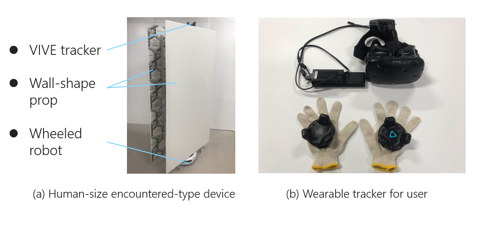

# Dynamic-Room

This README was first written by Yan on 2019/8/2.

## Abstract

This project is tring to provide physical feedback for virtual room structures in room-scale VR. The method we use is navigating a set of robotic walls to match the position and orientation of the virtual structure the user is going to touch and encounter the user's touch. All the robotic walls and the user is tracked by a tracking system. User can explore a 3 m × 4 m 4-wall room with physical feedback through 3 or 2 robotic walls. And we also provide a simulation without robotic walls to show how this system work. In this project, we achieve this system through 2 different algorithm, Detection Algorithm and Machine Learning Combined Algorithm. We provide example scene for every algorithms. 

## Collaborators
- Current
  - Yan Yixian
- Past
  - Nobody

# Software Version
- **Unity 2018.3.11f1**
- IDE (Visual Studio 2017)
- Python 2.7

Unity plugin / Unity Asset
- Final IK 1.6
- SteamVR 1.0
- NetMQ 4.0.0.207
- AsyncIO 0.1.69

Python Library
- zmq
- numpy
- pandas
- sklearn
- joblib

# Hardware Version
VR Devices
- HTC Vive
- TPCAST Wireless Adapter for Vive

Robotic Wall
- Actuator
  - IRobot Roomba 600 Series
- Overview
  

# Structure of project

## Scenes

| Scene Name | Build Target | Description |
----|----|---- 
| *Real_Detection* | Windows | 4-wall room with Detection Algorithm and real robotic walls. |
| *Simulation_Detection* | Windows | 4-wall room with Detection Algorithm and simulated robotic walls. |
| *Real_ML* | Windows | 4-wall room with ML Combined Algorithm and real robotic walls. |
| *Simulation_ML* | Windows | 4-wall room with ML Combined Algorithm and simulated robotic walls. |

## Class
### Class Explanatory Text
#### Common Scripts
State Machine

| Class Name | Attached GameObject |Description (What does the class do?) |
----|----|---- 
| *WallState* | Animator.Wall(state) | Define the behaviour of robotic wall which is materializing virtual structure. |
| *Standby_State* | Animator.Standby(state) | Define the behaviour of robotic wall which is not materializing virtual structure and in standby. |

RVO Obstacle Avoidance

| Class Name | Attached GameObject |Description (What does the class do?) |
----|----|---- 
| *RVO_agent* | robotic wall | According to the goal position, plan the path without collsion for robotic wall, and send the waypoint to PID controller classes (Wall_To_Target). |
| *RVO_user_agent* | user avatar | Set user as a special RVO agent which's can't be controlled to make the robotic walls avoid user. |

Robotic Wall PID Controller

| Class Name | Attached GameObject |Description (What does the class do?) |
----|----|---- 
| *Robotic_Wall* | robotic wall | A short cut for calling all the classes on robotic wall gameobject.  |
| *RoombaControllerScript* | robotic wall | Store the functions to controll the roomba(actuator) in base layer. |
| *PID_Fuctions* | robotic wall | Store the functions of PID controller for real roomba. |
| *PID_Fuctions_Simulation* | robotic wall | Store the functions of PID controller for simulation. |
| *Wall_To_Target* | robotic wall | Use the functions of PID controller to drive the robotic wall to match the position and orientation of target gameobject. |

Virtual Wall

| Class Name | Attached GameObject |Description (What does the class do?) |
----|----|---- 
| *VirtualWall* | virtual wall | The basic class for virtual walls in the scenario.  |
| *RoboticWall_Requester* | virtual wall | Request a robotic wall for this virtual wall while it collide with detecting block. |
| *Slider_Controller* | virtual wall | Controll a slider moving with user along this virtual wall, this slider is indicating the position and orientation for the robotic wall which is used to materialize this virtual wall. |

Standby Points

| Class Name | Attached GameObject |Description (What does the class do?) |
----|----|---- 
| *Standby_Requester* | Stand_by | Find a waiting position for the robotic walls in standby state. |

#### Detection Algorithm

| Class Name | Attached GameObject |Description (What does the class do?) |
----|----|---- 
| *FSM_forDetection* | robotic wall | Finite state machine for robotic walls in detection algorithm. |
| *DetectBlockController* | DetectBlock | Control the position of detecting block to follow the user. |

#### ML Combined Detection Algorithm

Unity Side

| Class Name | Attached GameObject |Description (What does the class do?) |
----|----|---- 
| *FSM_forML* | robotic wall | Finite state machine for robotic walls in ML combined detection algorithm. |
| *DataCatcher* | Data_Processer | Collect data of user at realtime, and package them before sending to python side. |
| *Client_Object* | Data_Processer | Client of a socket connection between unity and python sides, send packaged data to python side (sever) and recieve the response . |
| *Allocator* | Data_Processer | Based on the response from python side, find the virtual wall most likely be touched by user and allocate a closest robotic wall to it . |

Python Side

| Flie Name |Description (What does the class do?) |
----|---- 
| *ML_Predictor* |Based on the data of user, predict which virtual wall the user going to touch, and return the ID of this virtual wall. |
| *ZMQ_Server* |Recieve the data of user from unity side and send back the result calculated by ML_Predictor. |
